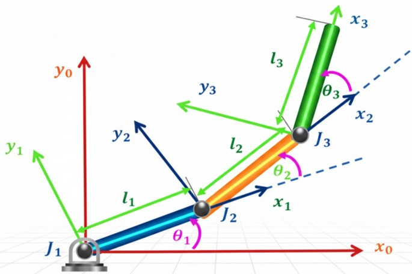

#+TITLE: AI & Robotics – 23CSE472 Course Notes

* Class 1: History of Robotics
Read the history slides.

* Class 2: Robot Fundamentals
** Components of a Robot
- PU (processing unit)
- Sensors and actuators
- Controllers
- User interface
- Manipulator linkage

** Definitions
- *Robot*: a reprogrammable, multifunctional manipulator.
- *Robotics*: the study of robots – the branch of technology dealing with the design, construction, operation and application of robots, as well as computer systems for their control.

** Classification of Robots
1. Manual handling robots
2. Fixed sequence robots
3. Variable sequence robots
4. Playback robots
5. Numerically controlled (NC) robots
6. Intelligent robots

** Mobile Robots
Robots can be fixed or mobile. Mobile robots are further classified into:
- Tracked robots
- Legged robots
- Wheeled robots

** Components vs. Human Anatomy
| Robot component | Human counterpart |
|-----------------+-------------------|
| Actuators       | Limbs             |
| Speaker         | Mouth             |
| Microphone      | Ears              |
| Odor sensor     | Nose              |
| Camera          | Eyes              |
| Controller/processor | Brain      |

** Interconnections
- Power conversion is connected to the actuators, sensors and controller.
- The controller is connected to the actuators, sensors, user interface and manipulator linkage.
- The manipulator linkage (fixed or movable) connects to the actuators.

** Actuators
- Generally motors used for controlling a mechanical system.
- Common robotics actuators utilise combinations of different electromechanical devices:
  1. DC motor
  2. Servo motor
  3. Stepper motor
  4. Brushless motor

** Degrees of Freedom (DOF)
- A manipulator has 7 DOF.
- How many DOF are required to place an object in space?
- What about the orientation of the object? Roll, pitch and yaw.

** Position and Orientation (Pose)
- A bound vector representation of a position in a plane:

\[
p = \begin{bmatrix} a \\ b \end{bmatrix} = a\hat{x} + b\hat{y}
\]

- Defining the position *and* orientation of an object with respect to a reference frame is called its *pose*.

** Coordinate Transformations
- Transformation of a point from frame \(B\) to frame \(A\) using the homogeneous transformation matrix:

\[
{}^A p = {}^A T_B \cdot {}^B p
\]

\[
{}^A T_B = \begin{bmatrix} {}^A R_B & {}^A t_B \\ 0 & 1 \end{bmatrix}
\]

- Composition of transformations:

\[
{}^A T_C = {}^A T_B \cdot {}^B T_C
\]

\[
{}^A p = {}^A T_B \cdot {}^B T_C \cdot {}^C p
\]

** Rotation and Translation in 2D
\[
{}^V p = {}^V R_B \cdot {}^B p
\]

\[
{}^A p = {}^A t_V + {}^V p
\]

\[
{}^A p = {}^A t_V + {}^V R_B \cdot {}^B p
\]

Equivalently:

\[
{}^A p = {}^A t_B + {}^A R_B \cdot {}^B p
\]

** Homogeneous Transformation Matrix
The affine equation \({}^A p = {}^A t_B + {}^A R_B \cdot {}^B p\) can be written in homogeneous form:

$\begin{bmatrix} A_x \\ A_y \end{bmatrix} = \begin{bmatrix} \cos\theta & -\sin\theta \\ \sin\theta & \cos\theta \end{bmatrix} \begin{bmatrix} B_x \\ B_y \end{bmatrix} + \begin{bmatrix} a_{xb} \\ a_{yb} \end{bmatrix}$

$\begin{bmatrix} A_x \\ A_y \\ 1 \end{bmatrix} = \begin{bmatrix} \cos\theta & -\sin\theta & a_{xb} \\ \sin\theta & \cos\theta & a_{yb} \\ 0 & 0 & 1 \end{bmatrix} \begin{bmatrix} B_x \\ B_y \\ 1 \end{bmatrix}$

Example translation: \(x = 120,\ y = 30,\ z = 40\).

** Rotation Matrices
Composite rotation:

\[
R = R_1 \cdot R_2 \cdot R_3
\]

Rotation about the \(x\)-axis:

\[
R_x(\theta) = \begin{bmatrix}
1 & 0 & 0 \\
0 & \cos\theta & -\sin\theta \\
0 & \sin\theta & \cos\theta
\end{bmatrix}
\]

** Planar Manipulators (Forward Kinematics in the XY Plane)
A planar manipulator has all joints rotating about the \(z\)-axis, so every link moves in the \(XY\) plane. Each revolute joint \(i\) is described by the 2D rotation matrix:

\[
R_z(\theta_i) = \begin{bmatrix} \cos\theta_i & -\sin\theta_i \\ \sin\theta_i & \cos\theta_i \end{bmatrix}
\]

The link frames are related by homogeneous transforms; the forward kinematics of the arm is the composition of one transform per joint:

\[
{}^0 T_n = {}^0 T_1 \cdot {}^1 T_2 \cdots {}^{n-1} T_n
\]

*** 1-Joint (1R) Planar Manipulator
A single link of length \(l_1\) attached to a revolute joint at the origin. The tip position is:

\[
x = l_1 \cos\theta_1, \qquad y = l_1 \sin\theta_1
\]

The homogeneous transformation from the base frame {0} to the tip frame {1} is a rotation \(R_z(\theta_1)\) followed by a translation \(l_1\) along the rotated \(x\)-axis:

\[
{}^0 T_1 = \begin{bmatrix} \cos\theta_1 & -\sin\theta_1 & l_1 \cos\theta_1 \\ \sin\theta_1 & \cos\theta_1 & l_1 \sin\theta_1 \\ 0 & 0 & 1 \end{bmatrix}
\]

Example: \(l_1 = 2\ \text{m},\ \theta_1 = 60^\circ\):

\[
{}^0 p = \begin{bmatrix} 2\cos 60^\circ \\ 2\sin 60^\circ \\ 1 \end{bmatrix} = \begin{bmatrix} 1.000 \\ 1.732 \\ 1 \end{bmatrix}
\]

*** 2-Joint (2R) Planar Manipulator
Two links \(l_1, l_2\) with joint angles \(\theta_1, \theta_2\). Link 2 makes an absolute angle \(\theta_1 + \theta_2\) with the \(x\)-axis, so the tip position is:

\[
x = l_1 \cos\theta_1 + l_2 \cos(\theta_1 + \theta_2)
\]

\[
y = l_1 \sin\theta_1 + l_2 \sin(\theta_1 + \theta_2)
\]

The transformation is the composition of two link transforms, where frame {2} is attached to the tip of link 2:

\[
{}^0 T_2 = {}^0 T_1 \cdot {}^1 T_2
\]

\[
{}^1 T_2 = \begin{bmatrix} \cos\theta_2 & -\sin\theta_2 & l_2 \cos\theta_2 \\ \sin\theta_2 & \cos\theta_2 & l_2 \sin\theta_2 \\ 0 & 0 & 1 \end{bmatrix}
\]

Multiplying the matrices gives the tip orientation \(R_z(\theta_1 + \theta_2)\):

\[
{}^0 T_2 = \begin{bmatrix} \cos(\theta_1+\theta_2) & -\sin(\theta_1+\theta_2) & l_1 \cos\theta_1 + l_2 \cos(\theta_1+\theta_2) \\ \sin(\theta_1+\theta_2) & \cos(\theta_1+\theta_2) & l_1 \sin\theta_1 + l_2 \sin(\theta_1+\theta_2) \\ 0 & 0 & 1 \end{bmatrix}
\]

Example: \(l_1 = l_2 = 1\ \text{m},\ \theta_1 = 45^\circ,\ \theta_2 = 30^\circ\):

\[
x = \cos 45^\circ + \cos 75^\circ = 0.7071 + 0.2588 = 0.9659
\]

\[
y = \sin 45^\circ + \sin 75^\circ = 0.7071 + 0.9659 = 1.6730
\]

*** 3-Joint (3R) Planar Manipulator
Three links \(l_1, l_2, l_3\) with joint angles \(\theta_1, \theta_2, \theta_3\). Link \(k\) makes an absolute angle \(\theta_1 + \cdots + \theta_k\), so the tip position is:

\[
x = l_1 \cos\theta_1 + l_2 \cos(\theta_1+\theta_2) + l_3 \cos(\theta_1+\theta_2+\theta_3)
\]

\[
y = l_1 \sin\theta_1 + l_2 \sin(\theta_1+\theta_2) + l_3 \sin(\theta_1+\theta_2+\theta_3)
\]

The transformation is the composition of three link transforms:

\[
{}^0 T_3 = {}^0 T_1 \cdot {}^1 T_2 \cdot {}^2 T_3
\]

Figure below: schematic of a 3-DOF planar (3R) manipulator with the three joint angles and link frames:

#+CAPTION: Schematic representation of the 3-DOF planar robotic manipulator (Fig. 1, Springer Nature Scientific Reports, doi:10.1038/s41598-026-53593-2).
#+ATTR_ORG: :width 520

Example: \(l_1 = l_2 = l_3 = 1\ \text{m},\ \theta_1 = 30^\circ,\ \theta_2 = 45^\circ,\ \theta_3 = 60^\circ\):

\[
x = \cos 30^\circ + \cos 75^\circ + \cos 135^\circ = 0.8660 + 0.2588 - 0.7071 = 0.4177
\]

\[
y = \sin 30^\circ + \sin 75^\circ + \sin 135^\circ = 0.5000 + 0.9659 + 0.7071 = 2.1730
\]

Note: the joint angles \(\theta_i\) are relative angles measured between neighbouring links; the absolute orientation of link \(k\) is the sum \(\theta_1 + \theta_2 + \cdots + \theta_k\).

** Orientation Representations
*** Euler Angles (3-angle representation)
+ The ZYZ convention is commonly preferred in aerospace and robotics.
+ The six Euler angle sets: XYX, XZX, YXY, YZY, ZXZ, ZYZ
*** Cardan Angles (3-angle representation)
+ Three rotations, one about each distinct axis (Tait–Bryan angles).
+ The six Cardan angle sets: XYZ, XZY, YXZ, YZX, ZXY, ZYX
*** Two-Axis (2-angle) Representation
+ Orientation described by two successive rotations about two distinct axes.
+ Example: $R = R_x(\alpha) \cdot R_y(\beta)$
+ Loses one degree of freedom; used only for specific applications.
*** Axis-Angle Representation
+ Any orientation can be reached by rotating through an angle $\theta$ about a fixed unit axis $u$.
+ Rodrigues' formula: $R = I\cos\theta + (1 - \cos\theta)\, u u^T + \sin\theta\, [u]_\times$
+ Uses 4 parameters (3 for the axis, 1 for the angle); no gimbal lock.

** Singularity and Gimbal Lock
When a degree of freedom is lost, the problem is called a *singularity*, popularly known as the *gimbal lock* problem.

** Two-Vector Representation
Orientation is described using two unit vectors fixed to the end-effector:
+ *Approach vector* \(a = (a_x, a_y, a_z)\): points along the direction in which the gripper approaches the object (usually the \(z\)-axis of the tool frame).
+ *Orientation vector* \(o = (o_x, o_y, o_z)\): points along the gripper fingers (usually the \(y\)-axis of the tool frame).
+ The *normal vector* is derived from the cross product: \(n = o \times a\).
+ The rotation matrix is formed by the three vectors as columns: \(R = \begin{bmatrix} n & o & a \end{bmatrix}\).

** Rotation about an Arbitrary Vector
+ A rotation about an arbitrary unit axis \(u = (u_x, u_y, u_z)\) by angle \(\theta\) leaves the axis invariant, so \(u\) must be an eigenvector of \(R\): \(R u = u\).
+ The corresponding eigenvalue is 1.
+ The remaining two eigenvalues are complex conjugates: \(\lambda = \cos\theta \pm i\sin\theta = e^{\pm i\theta}\).
+ The angle can be recovered from the trace: \(\mathrm{tr}(R) = 1 + 2\cos\theta\), hence \(\theta = \cos^{-1}\left(\frac{\mathrm{tr}(R) - 1}{2}\right)\).
+ The axis can be recovered from the skew-symmetric part of \(R\): \([u]_\times = \frac{1}{2\sin\theta}\left(R - R^T\right)\).
+ The resulting rotation matrix is given by Rodrigues' formula (see the Axis-Angle Representation above).
** Quaternion Representation
+ It is a hyper-complex number
+ Unit quaternion $q = (q_w,\ q_x,\ q_y,\ q_z)$ with $q = \left(\cos\frac{\theta}{2},\ \sin\frac{\theta}{2}\,\vec{u}\right)$.
+ Compact (4 parameters) and free of singularities.
+ Smooth interpolation (slerp) between orientations; widely used in robotics and aerospace.
** Comparison
+ *Rotation matrix*: 9 parameters, no singularity, but redundant.
+ *Euler/Cardan angles*: 3 parameters, compact, but suffers from gimbal lock.
+ *Axis-angle*: 4 parameters, no gimbal lock, but hard to interpolate.
+ *Quaternion*: 4 parameters, no singularity, best for interpolation and composition.

** Rotations via the Matrix Exponential
- Any rotation can be written as a matrix exponential. If \(S = [v]_\times \theta\) is the skew-symmetric matrix formed from the axis–angle vector \(v\theta\), then:

\[
R = e^{[v]_\times \theta} = \exp m(S)
\]

- The skew-symmetric matrix of a vector \(v = (v_x, v_y, v_z)\) is:

\[
[v]_\times = \begin{bmatrix} 0 & -v_z & v_y \\ v_z & 0 & -v_x \\ -v_y & v_x & 0 \end{bmatrix}
\]

- Evaluating the exponential gives exactly Rodrigues' formula, so the matrix exponential is the axis–angle representation in disguise.
- The inverse operation, the matrix logarithm \(S = \log m(R)\), recovers the skew-symmetric matrix; \(\mathrm{vex}(S)\) extracts the vector \(v\theta\) back out of it.
- RTB functions: \(R = \exp m(S)\), \(S = \log m(R)\), \(S = \mathrm{skew}(v)\), \(v = \mathrm{vex}(S)\).
- Example: for \(R_z(45^\circ)\), \(\log m(R) = \begin{bmatrix} 0 & 0.7854 \\ -0.7854 & 0 \end{bmatrix}\), so \(\mathrm{vex} = 0.7854\) — the angle in radians.

* Joints and Arm Configurations
** Joint Types
- *Revolute joint (R)*: rotary motion about a single axis; the joint variable is the angle \(\theta\).
- *Prismatic joint (P)*: linear (sliding) motion along an axis; the joint variable is the displacement \(d\).
- Each joint, revolute or prismatic, contributes exactly one degree of freedom.
- A serial arm is described by a string of joint letters from base to end-effector, e.g. RRR, RRP, RPR.

** Common Arm Configurations
*** PPP – Cartesian
Three prismatic joints moving along three perpendicular axes (gantry robot).

*** RPP – Cylindrical
Revolute base joint plus two prismatic joints: radial reach and vertical lift.

*** RRP – Spherical
Two revolute joints (base yaw and pitch) plus one prismatic joint (radial reach).

*** RRP – SCARA
Two parallel revolute joints in the horizontal plane plus one vertical prismatic joint.

*** RRR – Articulated
Three revolute joints (shoulder, elbow, wrist); anthropomorphic arm (PUMA-type).

*** RPR
Two revolute joints with a prismatic joint between them, e.g. a planar RPR arm.

- The planar 3R manipulator in the forward kinematics section is an RRR arm.
- A *spherical wrist* (three intersecting revolute axes) is also RRR; an articulated 6-DOF arm is written RRR-RRR (e.g. PUMA 560).
- A serial chain of \(n\) joints has \(n\) DOF; extra joints beyond the task requirement make the arm *redundant*.

* Task Space, Configuration Space, and Kinematics in 3D
Ref: Peter Corke, Robot Academy – masterclass "Robotic arms and forward kinematics" (lessons: What is kinematics, Task and Configuration space, 3D arms, Robot workspace).

** What Is Kinematics?
- *Kinematics* is the study of the motion of a body: positions, angles and velocities (translational and angular). Kinematics is *not* concerned with forces and moments — that is *dynamics*.
- In robotics there are two kinematic problems:
  1. *Forward kinematics*: given the robot's joint angles, what is the pose of the tool tip?
  2. *Inverse kinematics*: given the desired pose of the end effector, what joint angles achieve it? (The next topic in the masterclass.)

** Task Space and Configuration Space
- *Generalized joint coordinate*: the variable of joint \(i\) — an angle \(\theta_i\) for a revolute joint, a length \(d_i\) for a prismatic (sliding) joint.
- *Joint configuration*: the vector \(q = (q_1, \dots, q_N)\) of all joint coordinates, with \(N\) = number of joints.
- *Configuration space* \(C\): the set of all possible joint configurations; \(C \subset \mathbb{R}^N\). Its dimension is \(N\), the number of DOF of the robot.
- *Task space* \(T\): the set of all possible end-effector poses. In 2D, \(T\) is a subset of the planar translations/rotations; in 3D, \(T \subset SE(3)\). It is a subset, not the whole space, because a robot has finite reach.
- Dimension of the task space:
  - 2D arm, tip described by \((x, y)\): dim \(T = 2\) (a 2R planar arm).
  - Planar 3R arm, tip described by \((x, y, \theta)\): dim \(T = 3\).
  - 3D robot, tip described by \((x, y, z)\): dim \(T = 3\) (e.g. gantry, cylindrical).
  - 4-DOF SCARA: position \((x, y, z)\) plus a yaw angle: dim \(T = 4\).
  - Industrial 6-DOF arm: position \((x, y, z)\) plus roll, pitch, yaw: dim \(T = 6\).
- To reach *all* of the task space we need \(\dim(C) \ge \dim(T)\). A 2R planar arm (\(\dim C = 2 = \dim T\)) can position the tip but cannot choose its orientation; the planar 3R (\(\dim C = 3\)) can.
- A robot with \(\dim(C) > \dim(T)\) is *redundant*: with the extra joints it can control both the pose of the tool tip *and* the shape of its arm.
- The Cartesian (gantry, PPP) robot is a special case: the joint coordinates map directly onto the end-effector pose \((x, y, z)\).

** The 3-Link Robot (3R): Explanation
- The 3-link planar robot has 3 revolute joints and 3 DOF. With one DOF more than the 2-link arm it can reach any point inside its (large, circular) workspace *and* achieve any orientation at that point — the third joint lets the last link sweep through its full range of orientations while the tip stays fixed.
- Tip orientation: \(\theta = q_1 + q_2 + q_3\). Because all three angles are free, the orientation of the last link is independent of the tip position — this is what a real manipulation task needs.
- Corke's method: write the transform chain down *by inspection* — walk the frame from the base to the tip, one elementary transform per motion:

\[
{}^0 T_3 = \mathrm{Rz}(q_1) \cdot \mathrm{Tx}(l_1) \cdot \mathrm{Rz}(q_2) \cdot \mathrm{Tx}(l_2) \cdot \mathrm{Rz}(q_3) \cdot \mathrm{Tx}(l_3)
\]

where \(\mathrm{Tx}(l)\) translates by \(l\) along the *current* (rotated) \(x\)-axis. This is exactly the composition \({}^0 T_1 \cdot {}^1 T_2 \cdot {}^2 T_3\) expanded in the "3-Joint (3R) Planar Manipulator" section, and multiplying it out reproduces:

\[
x = l_1\cos q_1 + l_2\cos(q_1+q_2) + l_3\cos(q_1+q_2+q_3) \qquad\text{and}\qquad y = l_1\sin q_1 + l_2\sin(q_1+q_2) + l_3\sin(q_1+q_2+q_3)
\]

with orientation \(q_1+q_2+q_3\). Example (\(l_i = 1\), \(30^\circ, 45^\circ, 60^\circ\)): \(x = 0.4177,\ y = 2.1730,\ \theta = 135^\circ\).
- In MATLAB, do it symbolically (Robotics Toolbox):

#+begin_src matlab
syms l1 l2 l3 q1 q2 q3
T = trchain2('Rz(q1) Tx(l1) Rz(q2) Tx(l2) Rz(q3) Tx(l3)', [q1 q2 q3]);
% tip x-coordinate: T(1,3),  y-coordinate: T(2,3)
% (trchain2 is the classic RTB function; newer RTB 10 uses p3.trchain)
mdl_planar3   % script that creates p3, the planar 3-link model (links 1 m each)
p3.teach();   % move the sliders, watch the tip move
#+end_src

- As in the figure above, \(q_i\) are the *relative* angles between neighbouring links and may be negative (in the masterclass drawing \(q_3 < 0\)).

** Analyzing a Robot Arm That Moves in 3D
- The process is the same as in 2D, but now the elementary transforms are \(4\times 4\) matrices in \(SE(3)\), rotations can be about any axis (\(\mathrm{Rz}, \mathrm{Ry}, \mathrm{Rx}\)), and translations are along the current axis directions (\(\mathrm{Tx}, \mathrm{Ty}, \mathrm{Tz}\)).
- Example — the *cylindrical* 3-link robot (RRP): a revolute base joint \(q_1\) about the vertical \(z\), a vertical prismatic link of height \(h\), and a radial prismatic link of reach \(r\):

\[
{}^0 T_3 = \mathrm{Rz}(q_1) \cdot \mathrm{Tz}(h) \cdot \mathrm{Tx}(r) \qquad\Rightarrow\qquad x = r\cos q_1,\quad y = r\sin q_1,\quad z = h
\]

- Example — a 4-joint educational arm (RRRR): rotate about \(z\), rise along \(z\), then three rotations about \(y\) separated by \(z\)-translations:

\[
{}^0 T_4 = \mathrm{Rz}(q_1)\cdot\mathrm{Tz}(a_1)\cdot\mathrm{Ry}(q_2)\cdot\mathrm{Tz}(a_2)\cdot\mathrm{Ry}(q_3)\cdot\mathrm{Tz}(a_3)\cdot\mathrm{Ry}(q_4)\cdot\mathrm{Tz}(a_4)
\]

- The tip coordinates are the first three elements of the translation column of the product. MATLAB's \texttt{trchain} (3D version of \texttt{trchain2}) computes this symbolically.
- Corke's trick: imagine the robot stretched straight, then "walk" a frame from the base to the tip, writing one elementary transform per joint/link motion — the pose expression follows almost by inspection.

** General-Purpose Robot Arms in 3D
- Most industrial robots have 6 joints, all revolute (6 DOF), and are *serial-link* manipulators: base to end effector through a series of links and joints.
- Their task space is 6-dimensional: position \((x, y, z)\) and orientation (roll, pitch, yaw).
- Examples: PUMA 560 (RRR-RRR — articulated arm plus spherical wrist); the Stanford arm (5 revolute + 1 prismatic joint).
- The kinematic model of such an arm is the product of its six link transforms; the Denavit–Hartenberg table (next section) is the compact way to write it down.

** Robot Workspace
- *Workspace*: the set of all points the end effector can reach — the reachable volume. Robot datasheets show it as a plan view and a side elevation with the reachable region shaded.
- The workspace is typically *hollow*: the volume close to the robot's own body is unreachable, due to mechanical joint limits and because the control software prevents the arm from colliding with its own links or base.
- *Dextrous workspace*: the subset of points reachable with *any* orientation of the end effector.

* Denavit–Hartenberg (DH) Parameters
Ref: Peter Corke, Robot Academy – lesson "Denavit-Hartenberg notation"; RVC Ch. 5.

** The Idea
- Denavit and Hartenberg (1955) proposed a very general way to describe serial-link mechanisms: every joint is described by exactly *4 parameters* instead of the 6 numbers a general relative pose needs.
- The planar-arm matrices from the "Planar Manipulators" section are a special case of DH with \(d = 0\) and \(\alpha = 0\).

** The Four Parameters
For each link \(i\) (one row of the DH table):

| parameter | elementary transformation | meaning |
|-----------+---------------------------+------------------------------|
| \(\theta_i\) | rotation about the \(z\)-axis | joint angle (variable if joint \(i\) is revolute) |
| \(d_i\) | translation along the \(z\)-axis | link offset (variable if joint \(i\) is prismatic) |
| \(a_i\) | translation along the \(x\)-axis | link length |
| \(\alpha_i\) | rotation about the \(x\)-axis | link twist |

- If the robot has all revolute joints, the joint variables \(q_i\) substitute into the \(\theta\) column; for a prismatic joint, \(q_i\) substitutes into the \(d\) column. All other entries are constants fixed by the mechanical design.

** Link Frames and Placement Rules
- Attach a coordinate frame to the *far end* of every link (frame \(i\) on link \(i\), the end closest to the tool). A robot with \(n\) joints has \(n+1\) links, counting link 0 (the fixed base).
- The relative pose from frame \(i-1\) to frame \(i\) is the *link transform*

\[
A_i = \mathrm{Rz}(\theta_i) \cdot \mathrm{Tz}(d_i) \cdot \mathrm{Tx}(a_i) \cdot \mathrm{Rx}(\alpha_i)
\]

- Why 4 parameters suffice: the DH convention imposes two constraints on frame placement:
  1. the \(x\)-axis of frame \(i\) is *perpendicular* to the \(z\)-axis of frame \(i-1\);
  2. the \(x\)-axis of frame \(i\) *intersects* the \(z\)-axis of frame \(i-1\).
- A confusing but important consequence: the link frames are *not necessarily located on the link itself*.
- The axis of joint \(i\) is aligned with the \(z\)-axis of the *previous* frame \(z_{i-1}\): a revolute joint rotates about \(z_{i-1}\), a prismatic joint slides along \(z_{i-1}\).

** Link Transform (closed form)
Multiplying the four elementary transformations gives:

\[
A_i = \begin{bmatrix}
\cos\theta_i & -\sin\theta_i\cos\alpha_i & \sin\theta_i\sin\alpha_i & a_i\cos\theta_i \\
\sin\theta_i & \cos\theta_i\cos\alpha_i & -\cos\theta_i\sin\alpha_i & a_i\sin\theta_i \\
0 & \sin\alpha_i & \cos\alpha_i & d_i \\
0 & 0 & 0 & 1
\end{bmatrix}
\]

** DH Table and Forward Kinematics
- The whole robot is described by a compact table: one row per joint, columns \(\theta,\ d,\ a,\ \alpha\). This table completely describes the kinematics of the robot.
- Forward kinematics is the product of the link transforms:

\[
{}^0 T_n = A_1 \cdot A_2 \cdots A_n
\]

- The end-effector pose is a function of the joint configuration: \(\xi_n = K(q)\) — the kinematic model.

** Examples
*** 2-Link Planar Robot (RR)
The 2-link arm from the masterclass — the two link lengths appear in the \(a\) column, no \(z\)-translations (the robot lies in a plane), and \(\alpha = 0\) (all joint axes parallel):

| Link | \(\theta\) | \(d\) | \(a\) | \(\alpha\) |
|------+--------+-------+-------+-----------|
| 1 | \(q_1\) | 0 | \(a_1\) | 0 |
| 2 | \(q_2\) | 0 | \(a_2\) | 0 |

Each link transform reduces to \(A_i = \mathrm{Rz}(q_i)\mathrm{Tx}(a_i)\), exactly the \(3\times3\) link matrices used in the planar forward-kinematics section.

*** 3-Link Planar Robot (3R) — Worked Example
This is the DH description of the 3-link robot explained above:

| Link | \(\theta\) | \(d\) | \(a\) | \(\alpha\) |
|------+--------+-------+-------+-----------|
| 1 | \(q_1\) | 0 | \(l_1\) | 0 |
| 2 | \(q_2\) | 0 | \(l_2\) | 0 |
| 3 | \(q_3\) | 0 | \(l_3\) | 0 |

With \(\alpha = 0\) the general closed form collapses to \(A_i = \mathrm{Rz}(q_i)\mathrm{Tx}(l_i)\), and

\[
{}^0 T_3 = A_1 A_2 A_3 = \begin{bmatrix} \cos\theta_{\mathrm{tip}} & -\sin\theta_{\mathrm{tip}} & x \\ \sin\theta_{\mathrm{tip}} & \cos\theta_{\mathrm{tip}} & y \\ 0 & 0 & 1 \end{bmatrix}
\]

with \(\theta_{\mathrm{tip}} = q_1+q_2+q_3\) and \(x, y\) as in the 3R section (check: \(l_i = 1\), \(30^\circ, 45^\circ, 60^\circ\) gives \(x = 0.4177, y = 2.1730, \theta = 135^\circ\)).

*** PUMA 560 (6R Articulated, RRR-RRR)
The classical example of a general-purpose 3D arm (Corke, RVC; RTB \texttt{mdl\_puma560}). The last three joint axes intersect (spherical wrist), so \(a_4 = a_5 = a_6 = 0\).

| Link | \(\theta\) | \(d\) | \(a\) | \(\alpha\) |
|------+--------+------------+------------+------------|
| 1 | \(q_1\) | 0 | 0 | \(90^\circ\) |
| 2 | \(q_2\) | 0 | 0.4318 | \(0^\circ\) |
| 3 | \(q_3\) | 0.15005 | 0.0203 | \(-90^\circ\) |
| 4 | \(q_4\) | 0.4318 | 0 | \(90^\circ\) |
| 5 | \(q_5\) | 0 | 0 | \(-90^\circ\) |
| 6 | \(q_6\) | 0 | 0 | \(0^\circ\) |

(Units: metres; values follow RTB \texttt{mdl\_puma560} — Corke/Paul's convention, verified against the toolbox source. \texttt{alpha} signs of the individual joints are convention-dependent between textbooks; the other textbooks flip some axis directions, not the lengths.)

*** Worked Example: 3-Link Robot with Non-Zero Offsets (all joints at \(90^\circ\))
Given the following DH parameters (\(\theta\) in degrees, lengths in metres):

| Link | \(\theta\) | \(d\) | \(a\) | \(\alpha\) |
|------+--------+-------+-------+-----------|
| 1 | \(90^\circ\) | 2 | 1 | \(90^\circ\) |
| 2 | \(90^\circ\) | 0 | 3 | \(0^\circ\) |
| 3 | \(90^\circ\) | 0 | 1 | \(0^\circ\) |

Substitute each row into the closed-form link transform. With \(\theta = 90^\circ\) (so \(\cos\theta = 0,\ \sin\theta = 1\)):

\[
A_1 = \begin{bmatrix} 0 & 0 & 1 & 0 \\ 1 & 0 & 0 & 1 \\ 0 & 1 & 0 & 2 \\ 0 & 0 & 0 & 1 \end{bmatrix} \qquad
A_2 = \begin{bmatrix} 0 & -1 & 0 & 0 \\ 1 & 0 & 0 & 3 \\ 0 & 0 & 1 & 0 \\ 0 & 0 & 0 & 1 \end{bmatrix} \qquad
A_3 = \begin{bmatrix} 0 & -1 & 0 & 0 \\ 1 & 0 & 0 & 1 \\ 0 & 0 & 1 & 0 \\ 0 & 0 & 0 & 1 \end{bmatrix}
\]

Check \(A_1\): \(c\theta = 0,\ s\theta = 1,\ c\alpha = 0,\ s\alpha = 1\). Column 3 is \((s\theta\, s\alpha,\ -c\theta\, s\alpha,\ c\alpha) = (1, 0, 0)\); the translation column is \((a\,c\theta,\ a\,s\theta,\ d) = (0\cdot 1,\ 1\cdot 1,\ 2) = (0, 1, 2)\) — matches.

Forward kinematics is the product:

\[
{}^0 T_3 = A_1 A_2 A_3 = \begin{bmatrix} 0 & 0 & 1 & 0 \\ -1 & 0 & 0 & 0 \\ 0 & -1 & 0 & 5 \\ 0 & 0 & 0 & 1 \end{bmatrix}
\]

Reading off the result:
- Tip position: \((x, y, z) = (0, 0, 5)\) — the end effector sits 5 m above the base.
- Orientation: columns are \(n = (0,-1,0),\ o = (0,0,-1),\ a = (1,0,0)\); check it is a proper rotation: \(R R^T = I\) and \(\det R = +1\).
- Structure: \(\alpha_1 = 90^\circ\) makes the joint-2 axis perpendicular to the base axis; \(d_1 = 2\) raises the column; \(\alpha_2 = \alpha_3 = 0\) means joints 2 and 3 turn about parallel axes (a planar sub-arm) with reaches \(a_2 = 3,\ a_3 = 1\).

In MATLAB (Robotics Toolbox): RTB *ignores* a non-zero \(\theta\) column for revolute joints — \(\texttt{Link.A}\) uses the joint coordinate passed to \(\texttt{fkine}\) (a non-zero \(\theta\) column only makes sense for prismatic joints). Put the \(90^\circ\) into \(q\) instead (same result):

#+begin_src matlab
DH = [0 2 1 pi/2; 0 0 3 0; 0 0 1 0];   % theta col 0; rows: theta d a alpha
p = SerialLink(DH, 'name', '3-link example');
p.fkine([pi/2 pi/2 pi/2])   % all three joints at 90 deg
% tip position (0, 0, 5) and orientation as above
#+end_src

** Base and Tool Transforms
- The kinematic model \(K(q)\) gives the pose of the last (flange) frame w.r.t. the base (link 0) frame.
- In a factory the robot is placed somewhere in a *world* frame: the *base transform* \(T_{\mathrm{base}}\) is the pose of link 0 in the world (bolted to the floor, hanging upside down from a rail, ...).
- The tool (gripper, grinder, ...) is mounted on the flange: the *tool transform* \(T_{\mathrm{tool}}\) is the (constant, carefully measured) pose of the tool tip w.r.t. the flange.
- End-effector pose in the world is the compound:

\[
\xi = T_{\mathrm{base}} \cdot K(q) \cdot T_{\mathrm{tool}}
\]

- In RTB set \texttt{robot.base} and \texttt{robot.tool} (e.g. \texttt{p3.base = transl(10, 15, 2)} or flip the robot: \texttt{base = rotx(pi)}; a tool offset: \texttt{tool = transl(0, 0, 0.2)}).

** DH in MATLAB (RTB)
#+begin_src matlab
% planar 3R: rows are [theta d a alpha]; theta is filled from q automatically
DH = [0 0 1 0; 0 0 1 0; 0 0 1 0];
p3 = SerialLink(DH, 'name', 'planar 3R');
p3.fkine([pi/6 pi/4 pi/3])   % pose for 30, 45, 60 deg
p3.teach();

% PUMA 560 ready-made: uses the DH table above
mdl_puma560
p560.fkine(qz)   % current RTB: p560 (older versions used P560)
#+end_src
