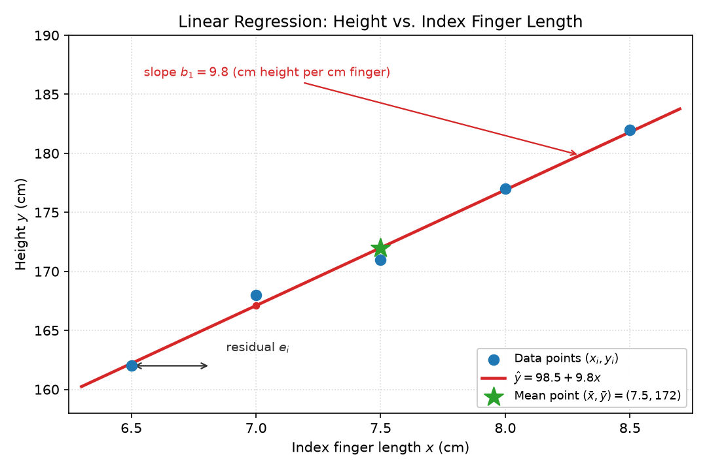

* Introduction to Machine Learning
** Difference between Algorithms and ML Algorithms
- *Algorithms:* Input is given and output is computed directly.
- *ML Algorithms:* Input and output data are analysed to come up with a logical expression. With any input the output is obtained.
- *Algorithm eg:* $f(x) = 3x + 5$, Temp in F = 9/5(Temp in C + 32)
- *ML Algorithm eg:* $1 \to 5$, $2 \to 9$, $3 \to 14$ (pattern learned from data)

** Types of ML Algorithms
- *Supervised:* Classification, Regression.
  Model trained using labeled training data. Both input and correct output given; algo learns relationship.
- *Unsupervised:* Clustering.
  Model trained using unlabeled data. Algo identifies hidden patterns/structures without correct output.

** Classification vs Regression vs Clustering
- *Classification:* Outputs belong to predefined categories/buckets.
  - *Disadvantage:* Can't create new category for outputs not in predefined set.
  - *Examples:* Finding suitable jobs based on requirements, grades from marks.
- *Regression:* Continuous output with no predefined set of values.
- *Clustering:* Finding coherent links in data and forming clusters.

** Vectors and Scalar
- *Vector:* Has magnitude and direction (eg: velocity).
- *Scalar:* Has only magnitude (eg: speed).

** 3 Phases During Training of an Algorithm
1. *Training:* Finding $x \to y$. Finding best possible $f(x) = y$.
2. *Validation:* Find direction of training (correctness). Decrease of error. Generalization.
3. *Testing:* Upon completion of training, checking fitment (how well it fits the algorithm).

** Vector Space
- *Example:* Classify if student is hostler or day scholar.
  - Features: length of little finger, # pairs of shoes, travel time, sleeping time, commute mode.
  - Dimension = 5, input is 5-vector: $(1, 2, 3, 4, 5)$.
  - Output is scalar (hostler or day scholar).
  - $x \to y$.

* Measurable Values and Data Types
** Overview
- Observable values we face while working with data.
- *Quantitative / Numerical:* Interval, Ratio.
- *Qualitative / Categorical:* Nominal, Ordinal.

** Nominal Data
- Observable data which can't be measured, values have equal value/parent.
- *Examples:* Phone number, Roll number.
- One value is 1 and all others are 0.

** Ordinal Data
- There is an order to the data.
- *Examples:* Grading S, A, B. Customer Satisfaction Survey (Happy, Good, Bad).
- Operators: $=, \neq, >, <$.

** Interval Data
- Operators: $+, -, =, \neq, <, >$.
- No standard ground 0.
- *Example:* Pass mark for a subject may not be same for all subjects.

** Ratio Data
- Operators: $+, -, =, \neq, <, >, \times, \div$.
- Baseline is uniform and universal.

* Encoding
- $x \to y$. Feature vector $\to$ label.
- Process of converting categorical data to scalar data mapping.
- *Feature vector:* $X = [\dots]$, $50 \times 5$. *Label:* $y$.
- $m \times n$, $\text{rank}(O) = \min(m, n)$.
- Classification model maps feature vector to label: $OC = L$, so $C = O^{-1} L$.

** Label Encoding
- Scalar to scalar mapping, typically used for ordinal features.

** One-Hot Encoding
- Conversion into pseudo scalar-vector mapping, typically used for nominal data.
- *Example:* Instead of 7 days of week, use 3 binary questions:
  1. Is it within first half of week (Mon-Wed or Thu-Sun)?
  2. Is it within first half of previous question (Mon/Tue or Thu/Fri)?
  3. Is it within first half of previous question (Mon or Thu)?

* Distance and Similarities
** Distance Metrics
*** Manhattan / Cityblock / Taxi Cab
- $\text{Manhattan} = |P_x| + |P_y|$
- $\text{dist}(P_1, P_2) = \sum_{i=1}^{n} |P_1(i) - P_2(i)|$

*** Euclidean Distance
- $\text{mag}(v) = \sqrt{v_x^2 + v_y^2}$
- $\sqrt{\sum_{i=1}^{n} (P_1(i) - P_2(i))^2}$

*** Minkowski Distance
- $(\sum_{i=1}^{n} (|P_1(i) - P_2(i)|)^p)^{1/p}$

** Similarities
- *Binary vector:* Simple Matching Coefficient (SMC), Jaccard Coefficient (JC).
- *Real Vector:* Cosine Similarity.

*** SMC (Simple Matching Coefficient)
- $0$ = didn't match, $1$ = did match.
- $SMC = \frac{P_{00} + P_{11}}{P_{00} + P_{11} + P_{10} + P_{01}}$
- *Disadvantage:* On large datasets with few matching items, answer is mostly 1.
- *Real life:* Student Attendance, Employee access Permissions, Device Status Monitoring.

*** JC (Jaccard Coefficient)
- $JC = \frac{P_{11}}{P_{11} + P_{10} + P_{01}}$
- *Real life:* Medical diagnosis, Market Basket Analysis, Movie Recommendation, Document Similarity (Search engines, Plagiarism detection).

*** Cosine Similarity
- $\text{Cosine Similarity}(A, B) = \frac{A \cdot B}{|A| |B|}$
- Measures coherence between vectors (highly coherent vs least coherent).

** When to Use What
- *Similarity:* How similar are two objects?
- *Distance:* How far apart are two objects? Magnitude matters for similarity.
- Where magnitude matters mainly, use distance (eg: charge/discharge cycle prediction).
- Where direction of data matters more, use cosine (eg: recommendation systems).

* K-means Clustering
- Mean: $\mu = \frac{1}{N} \sum_{i=1}^{N} X_i$
- Distance based algorithm - how close data points are in vector space.
- Number of groups is $K$, each group represented by its mean value (K-means clusters).
- Each vector gets grouped to nearest mean value.

** Steps
1. Take $K$-random centroids / mean points.
2. Calculate distance $(P \to C)$ where $P = 1$ to no. of data points, $C = 1$ to no. of centroids $K$.
3. Find nearest centroid for $P$ based on distance (centroid represents a cluster).
4. Assign point $P$ to cluster $C$ with min dist.
5. Repeat for all points.
6. Calculate new centroids.
7. Repeat steps 2 to 6.
8. Continue till no shift in centroid (convergence criteria / cluster memberships do not change).

** Disadvantages
1. When a point is equi-distance to two or more clusters (can't be assigned).
2. Choosing the right $K$ value.
3. Outliers can influence how clusters are formed.
4. A zero member cluster can be formed.
5. Only numerical data can be used.

** Solutions / Notes
1. If data points are equi-distant, it is bad practice to use k-means.
2. The outlier can become a one member cluster.
3. If cluster is very far from any data point, centroid stays in original place.
4. When two features have large distance, it influences calculation (disadvantage).

** How to Select the K Value
- *Within Cluster Sum of Squares (WCSS):*
  $WCSS = \sum_{i=1}^{K} \sum_{j=1}^{N_i} (P_{ij} - \bar{C_i})^2$
- Optimal number of clusters = elbow point.
- WCSS becomes close to 0 when no. of clusters = no. of data points.

** Good Cluster Formation
1. High intra-cluster similarity.
2. Compactness.
3. Well separated clusters.
4. Well separated classes.
5. Meaningful grouping.
6. Centroid of different clusters should be far apart.

** Example Calculation: Data $1, 2, 4, 5$
- $K=1$: $\mu = \frac{1+2+4+5}{4} = 3$.
  $WCSS = (1-3)^2 + (2-3)^2 + (4-3)^2 + (5-3)^2 = 4+1+1+4 = 10$.
- $K=2$: Clusters $\{1,2\}$ and $\{4,5\}$.
  $C_1 = 1.5$, $C_2 = 4.5$.
  $WCSS = 0.5 + 0.5 = 1$.

** K-medoid Clustering
- Centroids are replaced with nearest actual data points known as medoids.

* Normalization
** Min-Max
- Shifts the minimum to 0.
- $X'(i) = \frac{X(i) - \min(X)}{\max(X) - \min(X)} \times (\max(X') - \min(X')) + \min(X')$
- Spread of original dataset $\to$ Spread of modified normalized dataset.
- *Sensitive to outliers.*
- Use when data is uniformly distributed.

** Z-Score
- Shifts the mean to the origin.
- $X'(i) = \frac{X(i) - \mu}{\sigma}$
- Where $\mu$ = mean, $\sigma$ = standard deviation.
- Compressing or expanding the spread.
- *Not disturbed by outliers.*
- Use when data is normally distributed.

** Notes
- Clusters would be disturbed during normalization.

* Silhouette Coefficient
- $a(i)$ = avg distance of $i^{\text{th}}$ point in Cluster $A$ (intra-cluster).
- $b(i)$ = avg distance of $i^{\text{th}}$ point to all points in Cluster $B$, where $B$ is closest cluster to $A$ (nearest-cluster).
- $S(i) = \frac{b(i) - a(i)}{\max(a(i), b(i))}$

** When $b(i) < a(i)$
- Occurs when a data point is closer to a neighbouring cluster than to its assigned cluster.
- Indicates the point has been assigned to the *wrong cluster*.

** Example
- $C_A \to 90, 91, 89, 92$.
- $C_B \to 60, 61, 59, 62$.
- If student with 61 marks is placed in $C_A$: distance within $C_A$ would be large, distance with $C_B$ would be small.
- So $b < a$.
- *Conclusion:* If any point gets assigned to wrong cluster, then $b < a$.

* Classification Performance Evaluation
- After training, a classification model must be evaluated to check how well it predicts.
- Evaluation compares the *predicted label* of each sample with its *actual class label*.

** Observed Vector, Class Label and Predicted Label
- *Observed Vector:* The feature vector (input) of one sample, e.g. a student's features.
- *Class Label ($y$):* The correct / true class the sample actually belongs to (given in labeled training/test data).
- *Predicted Label ($\hat{y}$):* The class output by the model for that observed vector.
- The model maps observed vector $\to$ predicted label: $\hat{y} = f(x)$.
- Evaluation table comparing actual vs predicted for each observed vector:

| Observed Vector | Class Label (actual $y$) | Predicted Label ($\hat{y}$) | Correct? |
|-----------------|--------------------------|------------------------------|----------|
| $x_1$           | Positive                 | Positive                     | Yes      |
| $x_2$           | Negative                 | Positive                     | No       |
| $x_3$           | Negative                 | Negative                     | Yes      |
| $x_4$           | Positive                 | Negative                     | No       |

- Correct predictions get counted; wrong predictions get classified as false positives or false negatives.

** Confusion Matrix
- A $2 \times 2$ table summarizing how many samples fell in each combination of actual vs predicted class.
- Rows = actual class, Columns = predicted class.

|                    | Predicted Positive | Predicted Negative |
|--------------------|--------------------|--------------------|
| *Actual Positive*  | True Positive (TP) | False Negative (FN)|
| *Actual Negative*  | False Positive (FP)| True Negative (TN) |

- *True Positive (TP):* Actual positive, predicted positive (correct hit).
- *True Negative (TN):* Actual negative, predicted negative (correct rejection).
- *False Positive (FP):* Actual negative, predicted positive (Type I error / false alarm).
- *False Negative (FN):* Actual positive, predicted negative (Type II error / miss).
- Diagonal entries (TP, TN) are correct predictions; off-diagonal entries (FP, FN) are errors.

*** Multi-Class Confusion Matrix (Chilli / Potato / Tomato Example)
- The 2x2 matrix extends to an NxN matrix for N classes. Rows = actual class, columns = predicted class.
- Example: a model classifies vegetables into Chilli, Potato or Tomato. 30 test samples: 10 actual chillis, 10 actual potatoes, 10 actual tomatoes.
- Predictions: 8 chillis correct, 1 chilli predicted as potato, 1 chilli predicted as tomato; 2 potatoes predicted as chilli, 7 potatoes correct, 1 potato predicted as tomato; 0 tomatoes predicted as chilli, 1 tomato predicted as potato, 9 tomatoes correct.

| Actual \ Predicted | Chilli | Potato | Tomato |
|---------------------|--------|--------|--------|
| Chilli              | 8      | 1      | 1      |
| Potato              | 2      | 7      | 1      |
| Tomato              | 0      | 1      | 9      |

- *Diagonal = correct predictions:* 8 + 7 + 9 = 24. $\text{Accuracy} = \frac{24}{30} = 0.8$
- *Off-diagonal = misclassifications:* e.g. the 2 in row Potato / column Chilli means 2 actual potatoes were predicted as chillis.
- *Per-class metrics (one-vs-rest):* treat each class as positive, all others as negative.
  - *Chilli:* Precision = 8/(8+2+0) = 0.8, Recall = 8/(8+1+1) = 0.8.
  - *Potato:* Precision = 7/(7+1+1) ≈ 0.778, Recall = 7/(7+2+1) = 0.7.
  - *Tomato:* Precision = 9/(9+1+0) ≈ 0.818, Recall = 9/(9+0+1) = 0.9.
- F1 is computed per class the same way as in the binary case; macro-average F1 = mean of per-class F1 values.

** Performance Metrics in terms of the Confusion Matrix
- All metrics are computed from TP, TN, FP, FN.

*** Accuracy
- $\text{Accuracy} = \frac{TP + TN}{TP + TN + FP + FN}$
- Fraction of total predictions that are correct.
- *Disadvantage:* Misleading on imbalanced data (if 95% are negative, always predicting negative gives 95% accuracy).

*** Precision
- $\text{Precision} = \frac{TP}{TP + FP}$
- Of all samples *predicted* positive, fraction that are actually positive.
- Focuses on false positives (how many positive predictions were wrong).
- Used where false positives are costly (e.g. spam filter marking good mail as spam).

*** Recall / Sensitivity / True Positive Rate
- $\text{Recall} = \frac{TP}{TP + FN}$
- Of all samples that are *actually* positive, fraction that were correctly predicted positive.
- Focuses on false negatives (how many positive samples were missed).
- Used where missing positives is costly (e.g. disease detection).

*** F-Score / F1-Score
- $F_1 = 2 \times \frac{\text{Precision} \times \text{Recall}}{\text{Precision} + \text{Recall}}$
- Harmonic mean of precision and recall, balances both.
- $F_1$ is high only when both precision and recall are high.
- If precision or recall is 0, $F_1 = 0$.

*** $F_\beta$ Score (Generalized F-Score)
- General form of the F-score with a parameter $\beta$ controlling the weight of recall relative to precision.
- $F_\beta = (1 + \beta^2) \times \frac{\text{Precision} \times \text{Recall}}{(\beta^2 \times \text{Precision}) + \text{Recall}}$
- $\beta = 1$: Equal weight to precision and recall $\Rightarrow$ same as $F_1$.
- $\beta < 1$: Precision is weighted more than recall (e.g. $F_{0.5}$, precision weighed 2 times more).
- $\beta > 1$: Recall is weighted more than precision (e.g. $F_2$, recall weighed 2 times more).
- When $\beta^2 \times \text{Precision} = \text{Recall}$, the formula reduces to $F_1$.
- *Use cases:*
  - $F_2$ score when false negatives are costlier (e.g. disease detection, missing a positive case).
  - $F_{0.5}$ score when false positives are costlier (e.g. spam filter flagging good mail).

** Example Calculation
- Suppose test results give: $TP = 40$, $TN = 30$, $FP = 10$, $FN = 20$.
- $\text{Accuracy} = \frac{40 + 30}{40 + 30 + 10 + 20} = \frac{70}{100} = 0.7$
- $\text{Precision} = \frac{40}{40 + 10} = \frac{40}{50} = 0.8$
- $\text{Recall} = \frac{40}{40 + 20} = \frac{40}{60} \approx 0.667$
- $F_1 = 2 \times \frac{0.8 \times 0.667}{0.8 + 0.667} = 2 \times \frac{0.533}{1.467} \approx 0.727$
** Assignment
Find a situation where Type-I error (False Positives) has more consequences than Type-II error

* Model Generalization
- *Generalization:* how well a trained model performs on new, unseen data (not just the data it was trained on).
- A model generalizes well when the pattern learned from training data holds for unseen data.
- Related to the Validation phase (see *3 Phases During Training of an Algorithm*).

** Underfitting (High Bias)
- Model is too simple to capture the pattern in the data (e.g. a straight line fit to non-linear data).
- Both training error and test error are high.
- Causes: too few features, model too simple, training stopped too early.
- Fixes: add more features, use a more complex model, train longer.

** Optimal Fit (Good Generalization)
- Model captures the true underlying pattern without memorizing noise.
- Both training error and test error are low. This is the goal of training.

** Overfitting (High Variance)
- Model is too complex and memorizes the training data, including noise and outliers.
- Training error is very low (near zero) but test error is high.
- Causes: too many features/parameters, too little training data, training too long.
- Fixes: more training data, regularization, simpler model (fewer features), early stopping, cross-validation.

** Bias-Variance Trade-off
- *Bias:* error due to simplifying assumptions in the model (model cannot represent the true pattern) -> underfitting.
- *Variance:* error due to sensitivity to small fluctuations in the training data -> overfitting.
- Total error = Bias^2 + Variance + irreducible error.
- As model complexity increases: bias decreases, variance increases. The optimal fit is the sweet spot between the two.

** Diagnosing Generalization Problems
- Compare training error with validation/test error:
  - Both high -> underfitting.
  - Training low, test high -> overfitting.
  - Both low -> good generalization.
- Learning curves (error vs training iterations or training set size) help spot these cases.

** Summary
| Model        | Training Error | Test Error | Problem       | Fix                                    |
|--------------|----------------|------------|---------------|----------------------------------------|
| Underfitting | High           | High       | High bias     | More features, more complex model      |
| Optimal fit  | Low            | Low        | None          | -                                      |
| Overfitting  | Very low       | High       | High variance | More data, regularization, early stop  |

* Missing Data and Remedial Strategies
- Real-world datasets often contain missing values (blank cells / NaN) due to sensor failures, unanswered survey questions, human error, etc.
- Most ML algorithms cannot process missing values directly, so the data must be cleaned before training.

** Types of Missing Data
*** MCAR (Missing Completely At Random)
- The absence of a value is unrelated to any other value (observed or missing).
- Example: a sensor randomly fails to record one reading.
- Missing rows behave like a random sample of the full dataset, so any remedial strategy works well.

*** MAR (Missing At Random)
- The absence depends on *observed* values, not on the missing value itself.
- Example: junior employees are more likely to skip the salary question (designation is observed, salary is missing).

*** MNAR (Missing Not At Random)
- The absence depends on the missing value itself.
- Example: very tall people do not report their height.
- Hardest to handle, because the very fact that the value is missing carries information.

** Remedial Strategies
*** 1. Deletion
- *Listwise Deletion:* drop the entire row if any feature value is missing.
  - Simple, but loses data; bad when many rows have missing values.
- *Pairwise Deletion:* use only the available values for each computation (distance, correlation).
  - Keeps more data, but each computation uses a different sample size.
- *Column Deletion:* drop a feature when most of its values are missing.
  - Reasonable when more than 60-70% of the column is missing.

*** 2. Imputation (Filling the Missing Values)
- *Mean Imputation:* replace missing values with the column mean $\mu = \frac{1}{N}\sum_{i=1}^{N} X_i$.
- *Median Imputation:* replace with the middle value of the sorted column.
- *Mode Imputation:* replace with the most frequent value; used for categorical data.
- Choice of central tendency:
  - Mean $\to$ numeric data that is roughly symmetric / normally distributed.
  - Median $\to$ numeric data with outliers (median is robust).
  - Mode $\to$ categorical data.
- *KNN Imputation:* replace the missing value with the mean / median / mode of its $K$ nearest neighbours (see K-means for distance).
- *Regression Imputation:* build a model on the complete rows and predict the missing value from the other features.

*** 3. Other Strategies
- *Multiple Imputation:* fill the dataset several times with different estimates, analyse each version and combine the results.
- *Forward / Backward Fill:* carry the last known value forward (or the next value backward); used for time series.

** Summary
| Strategy            | When to use                              | Drawback                            |
|---------------------|------------------------------------------|-------------------------------------|
| Listwise deletion   | Very few missing rows                    | Loses data                          |
| Mean / Median / Mode| Small fraction missing, simple baseline  | Reduces variance, introduces bias   |
| KNN / Regression    | Feature is related to other features     | Computationally costly on large data|
| Drop the column     | Column mostly missing                    | Feature information is lost         |
| Multiple imputation | Missing values with uncertainty          | Complex to implement and interpret  |

- Imputation reduces variance: filled values are artificial and cluster around the centre of the data.
- MNAR cannot be fixed by simple imputation - the missingness itself must be modelled.

* Regression Models
- Recap: in regression the output is *continuous* (no predefined set of values), unlike classification.
- Goal: learn $f$ such that $y = f(x)$ predicts a continuous output from the features.
- Examples: predicting price, temperature, height.

** Linear Regression
- Simplest regression model; assumes the relationship between the feature $x$ and the output $y$ is a straight line.
- Simple linear regression (single feature):
  $\hat{y} = b_0 + b_1 x$
  - $x$: input feature (independent variable).
  - $y$: actual output (dependent variable).
  - $\hat{y}$: predicted output.
  - $b_0$: intercept - value of $\hat{y}$ when $x = 0$.
  - $b_1$: slope - change in $\hat{y}$ per unit change in $x$.

*** Least Squares Method
- We need the line that fits the data best.
- *Residual:* $e_i = y_i - \hat{y}_i$, the difference between actual and predicted output.
- Best line minimizes the sum of squared errors (SSE):
  $SSE = \sum_{i=1}^{n} (y_i - \hat{y}_i)^2 = \sum_{i=1}^{n} (y_i - (b_0 + b_1 x_i))^2$
- Differentiating SSE w.r.t. $b_0$ and $b_1$ and setting to 0 gives:
  $b_1 = \frac{\sum_{i=1}^{n} (x_i - \bar{x})(y_i - \bar{y})}{\sum_{i=1}^{n} (x_i - \bar{x})^2}$
  $b_0 = \bar{y} - b_1 \bar{x}$
- Where $\bar{x}$ and $\bar{y}$ are the means of the feature and the output.
- The regression line always passes through the mean point $(\bar{x}, \bar{y})$.

*** Example: Guessing Height from Finger Length
- Goal: predict a person's height $y$ (cm) from the length of their index finger $x$ (cm).
- Data collected from 5 people:

| Finger length $x$ (cm) | Height $y$ (cm) |
|------------------------|-----------------|
| 6.5                    | 162             |
| 7.0                    | 168             |
| 7.5                    | 171             |
| 8.0                    | 177             |
| 8.5                    | 182             |

- Step 1 - Means:
  $\bar{x} = \frac{6.5 + 7.0 + 7.5 + 8.0 + 8.5}{5} = 7.5$, $\bar{y} = \frac{162 + 168 + 171 + 177 + 182}{5} = 172$
- Step 2 - Sums needed: $\sum x_i y_i = 6474.5$, $\sum x_i^2 = 283.75$
- Step 3 - Slope:
  $b_1 = \frac{6474.5 - 5(7.5)(172)}{283.75 - 5(7.5)^2} = \frac{6474.5 - 6450}{283.75 - 281.25} = \frac{24.5}{2.5} = 9.8$
- Step 4 - Intercept: $b_0 = 172 - 9.8(7.5) = 98.5$
- Step 5 - Model: $\hat{y} = 98.5 + 9.8x$
- *Interpretation:* each extra 1 cm of finger length adds 9.8 cm of height on average.
- The picture below shows the 5 data points, the fitted line, the mean point and the residuals:

  #+CAPTION: Linear regression fit of height on finger length (data, fitted line, residuals).
  #+ATTR_ORG: :width 520
  
- Predictions and residuals:

| Finger length $x$  | Predicted $\hat{y} = 98.5 + 9.8x$ | Actual $y$ | Residual $y - \hat{y}$ |
|-------------------|-----------------------------------|------------|------------------------|
| 6.5               | 162.2                             | 162        | -0.2                   |
| 7.0               | 167.1                             | 168        | +0.9                   |
| 7.5               | 172.0                             | 171        | -1.0                   |
| 8.0               | 176.9                             | 177        | +0.1                   |
| 8.5               | 181.8                             | 182        | +0.2                   |

- Residuals cancel out (sum = 0) because the least squares line is centered at $(\bar{x}, \bar{y})$.
- *Using the model:* a person with finger length 8.2 cm is predicted to be $98.5 + 9.8(8.2) = 178.9$ cm tall.
- The fit is based on only 5 samples; in practice hundreds of samples are used.

** Multiple Linear Regression (Preview)
- When there is more than one feature, the model extends to:
  $\hat{y} = b_0 + b_1 x_1 + b_2 x_2 + \dots + b_n x_n$

  assignment: is linear regression a linear function

** R$^2$ Score (Coefficient of Determination)
- measures how well the regression line fits the data: the proportion of variance in $y$ explained by the model
- residual (error) sum of squares: $SSE = \sum (y_i - \hat{y}_i)^2$
- total sum of squares: $SST = \sum (y_i - \bar{y})^2$ (variance of $y$ around its mean)
- regression sum of squares: $SSR = \sum (\hat{y}_i - \bar{y})^2$, and $SST = SSE + SSR$
- $R^2 = 1 - \frac{SSE}{SST} = \frac{SSR}{SST}$
- range: $0 \leq R^2 \leq 1$ for simple linear regression
  - $R^2 = 1$: perfect fit (all points on the line, $SSE = 0$)
  - $R^2 = 0$: model is no better than predicting the mean $\bar{y}$ for every point
  - $R^2$ can be negative when the model is worse than predicting the mean (e.g. a model fitted on one dataset evaluated on new data, or a line forced through the origin on data that does not pass through it)
- interpretation: $R^2 = 0.9$ means 90% of the variation in $y$ is explained by $x$
- for simple linear regression, $R^2 = r^2$: the square of the sample correlation coefficient
- caveat: adding more predictors never decreases $R^2$ (it stays the same if the predictor is useless), so for multiple regression use adjusted $R^2$ instead
- worked example (finger-length data, residuals -0.2, +0.9, -1.0, +0.1, +0.2):
  - $SSE = (-0.2)^2 + (0.9)^2 + (-1.0)^2 + (0.1)^2 + (0.2)^2 = 0.04 + 0.81 + 1.00 + 0.01 + 0.04 = 1.90$
  - $SST = (162-172)^2 + (168-172)^2 + (171-172)^2 + (177-172)^2 + (182-172)^2 = 100 + 16 + 1 + 25 + 100 = 242$
  - $R^2 = 1 - \frac{1.90}{242} \approx 0.992$: about 99.2% of the variation in height is explained by finger length

* Decision Trees and Ensemble Methods
- Decision trees split the data recursively into smaller groups. Ensembles combine many trees into one stronger model.

** Entropy
- *Entropy:* measure of impurity / disorder in a set of data. Higher entropy means the classes are more mixed.
- For a set $S$ with $c$ classes, where $p_i$ is the fraction of class $i$:
  $H(S) = -\sum_{i=1}^{c} p_i \log_2 p_i$
- The base of the log is 2, so entropy is measured in bits.
- *Entropy = 0:* all samples belong to one class (pure set).
- *Entropy = 1:* binary set with both classes equally mixed (maximum impurity).
- Range: $0 \leq H(S) \leq \log_2 c$.

*** Example: Marbles
- Bag with 4 red and 4 blue marbles:
  $H = -\left(\frac{4}{8} \log_2 \frac{4}{8} + \frac{4}{8} \log_2 \frac{4}{8}\right) = -(0.5 \times (-1) + 0.5 \times (-1)) = 1$
- Bag with 8 red marbles:
  $H = -(1 \times \log_2 1) = 0$ (pure set, no disorder).
- Bag with 6 red and 2 blue marbles:
  $H = -\left(\frac{6}{8} \log_2 \frac{6}{8} + \frac{2}{8} \log_2 \frac{2}{8}\right) = -(0.75 \times (-0.415) + 0.25 \times (-2)) \approx 0.811$

** Information Gain
- *Information Gain (IG):* the reduction in entropy after splitting on a feature. The feature with the highest IG is chosen for the split.
- Split set $S$ on feature $A$ into subsets $S_v$:
  $IG(S, A) = H(S) - \sum_{v \in \text{values}(A)} \frac{|S_v|}{|S|} H(S_v)$
- The weighted average of the child entropies is subtracted from the parent entropy.

*** Example: Pass / Fail
- 8 students, 4 pass and 4 fail. Parent entropy:
  $H(S) = -\left(\frac{4}{8} \log_2 \frac{4}{8} + \frac{4}{8} \log_2 \frac{4}{8}\right) = 1$
- Split on Attendance:
  - High: 3 pass, 1 fail $\to H = -\left(\frac{3}{4} \log_2 \frac{3}{4} + \frac{1}{4} \log_2 \frac{1}{4}\right) \approx 0.811$
  - Low: 1 pass, 3 fail $\to H \approx 0.811$
  - $IG = 1 - \left(\frac{4}{8} \times 0.811 + \frac{4}{8} \times 0.811\right) = 1 - 0.811 = 0.189$
- Split on Study hours:
  - High: 4 pass, 0 fail $\to H = 0$
  - Low: 0 pass, 4 fail $\to H = 0$
  - $IG = 1 - 0 = 1$
- Study hours gives the higher IG (1 > 0.189), so it becomes the root split.

** Gini Index
- Alternative impurity measure, also used for choosing splits.
- $\text{Gini}(S) = 1 - \sum_{i=1}^{c} p_i^2$
- Gini = 0 for a pure set; it is maximum when all classes are equally mixed.
- *Example:* 4 pass, 4 fail: $\text{Gini} = 1 - (0.5^2 + 0.5^2) = 0.5$
- For the Study-hours split above, both children are pure, so Gini = 0.
- *Entropy vs Gini:*

| Property               | Entropy                         | Gini                        |
|------------------------|---------------------------------|-----------------------------|
| Formula                | $-\sum p_i \log_2 p_i$          | $1 - \sum p_i^2$            |
| Range                  | $0$ to $\log_2 c$               | $0$ to $\frac{c-1}{c}$      |
| Computation            | Logarithm (slower)              | Squaring (faster)           |
| Max impurity (binary)  | 1                               | 0.5                         |
| Split choice           | Maximize entropy reduction      | Minimize Gini impurity      |

- Both usually select the same split. Gini is cheaper to compute and is the default in CART and most libraries.

** Decision Tree
- *Decision tree:* a model that splits the feature space into regions with a series of if-else questions.
- *Structure:*
  - *Root node:* the first feature used for the split.
  - *Internal node:* a feature test (e.g. Study hours = High?).
  - *Branch:* one outcome of a test.
  - *Leaf node:* final prediction (class or value).
- Prediction: start at the root, answer each question, follow the branch until a leaf.
- *Building steps:*
  1. Start with all training samples at the root.
  2. Compute the entropy (or Gini) of the current set.
  3. For each feature, compute the weighted child impurity and the IG.
  4. Split on the feature with the highest IG (or lowest Gini).
  5. Repeat recursively for each child node.
  6. Stop when a stopping rule is reached (pure node, no features left, pruning rule).
- *Advantages:* easy to interpret, handles categorical and numerical data, no feature scaling needed.
- *Disadvantages:* deep trees overfit easily (they memorize noise); small changes in the data can produce very different trees (high variance); greedy split selection is not globally optimal.

** Pruning
- *Pruning:* removing branches that add little predictive power, to reduce overfitting.
- *Pre-pruning (early stopping):* stop building the tree before it gets too deep.
  - Stopping rules: maximum depth, minimum samples per leaf, minimum samples per split, minimum IG threshold.
  - Advantage: cheaper to build. Disadvantage: hard to pick the right stopping point in advance.
- *Post-pruning (backward pruning):* build the full tree, then replace weak branches with leaves.
  - Cost-complexity pruning: remove a subtree when the small increase in error is worth the large decrease in tree size.
  - Advantage: the whole tree is seen before deciding. Disadvantage: more computation.
- *Comparison:*

|            | Pre-pruning                          | Post-pruning                        |
|------------|--------------------------------------|-------------------------------------|
| When       | During building (early stop)         | After building (trim branches)      |
| Computation| Cheaper                              | Costlier (full tree first)          |
| Risk       | Stops too early (underfitting)       | Needs a validation set to decide    |
| Result     | Smaller tree                         | Usually better accuracy             |

- Check pruning decisions on a validation set. Do not prune using only the training error.

** Ensemble Methods
- *Ensemble:* combine many weak models into one strong model.
- *Weak learner:* a model slightly better than random guessing (e.g. a shallow tree).
- Ensembles work because different models make different errors, and combining them cancels the errors.
- Two main families:
  - *Bagging:* train models in parallel, reduce variance (fixes overfitting).
  - *Boosting:* train models in sequence, reduce bias (fixes underfitting).

*** Bagging (Bootstrap Aggregating)
- *Steps:*
  1. Create $m$ bootstrap samples. Each sample picks $n$ instances *with replacement* from the training set, so some instances repeat and some are missing.
  2. Train a model (e.g. a deep tree) on each bootstrap sample, independently and in parallel.
  3. Combine the predictions: majority vote for classification, average for regression.
- Why bootstrap? Each model sees a slightly different dataset, so the models stay diverse.
- Bagging reduces *variance*: averaging many high-variance models gives a stable model (see bias-variance trade-off in *Model Generalization*).
- *Example:* with 10 training students, one bootstrap sample could be 1, 3, 3, 5, 7, 7, 7, 8, 9, 10. Some students repeat, one is missing. Five such samples give five trees, and the final answer is the majority vote.

*** Random Forest
- *Random Forest:* bagging applied to decision trees, with one extra trick.
- At each split, only a random subset of the features is considered (e.g. $\sqrt{p}$ for classification, $p/3$ for regression, where $p$ = number of features).
- Why? With plain bagging, every tree still splits on the strongest feature most of the time, so the trees stay correlated. Forcing a random feature subset decorrelates the trees and lowers variance further.
- *Out-of-bag (OOB) estimate:* a bootstrap sample keeps about 63% of the instances. The remaining 37% (out-of-bag) can be scored by that tree for free, which gives a validation estimate without a separate validation set.
- *Feature importance:* the average impurity reduction contributed by each feature across all trees.
- *Advantages:* very accurate, robust to noise, no pruning needed (trees can grow fully), easy to parallelize.
- *Disadvantage:* loses single-tree interpretability, and prediction is slower than one tree.

*** Boosting
- Models are trained *sequentially*. Each new model focuses on the mistakes of the previous ones.
- Later models get more weight on the hard (misclassified) samples.
- Boosting reduces *bias*: a sequence of weak learners converges to a strong learner.
- Boosting is sensitive to noisy data and outliers, because they get focused on repeatedly.

**** AdaBoost (Adaptive Boosting)
- *Steps:*
  1. Start with equal weights on all samples: $w_i = 1/n$.
  2. Train a weak learner (e.g. a decision stump) on the weighted data.
  3. Compute its weighted error $\epsilon = \frac{\text{sum of weights of misclassified}}{\text{total weight}}$.
  4. Give the model a say in the vote: $\alpha = \frac{1}{2} \ln\left(\frac{1 - \epsilon}{\epsilon}\right)$. A better model gets a larger $\alpha$.
  5. Update the sample weights: multiply by $e^{\alpha}$ if the sample was misclassified, by $e^{-\alpha}$ if correct, then normalize.
  6. Repeat for $m$ rounds.
  7. Final prediction: weighted vote of all models, each weighted by its $\alpha$.
- *Example:* if a stump has $\epsilon = 0.2$, then $\alpha = \frac{1}{2} \ln(0.8/0.2) = \frac{1}{2} \ln 4 \approx 0.693$.

**** Gradient Boosting
- Instead of re-weighting samples, each new model is trained on the *residuals* of the current combined model.
- *Residual:* $r_i = y_i - \hat{y}_i$. For classification, use the negative gradient of the loss (pseudo-residuals).
- *Steps (regression):*
  1. Start with a constant prediction, the mean of $y$: $\hat{y}_i^{(0)} = \bar{y}$.
  2. Compute the residuals $r_i = y_i - \hat{y}_i^{(m-1)}$.
  3. Fit a decision tree to predict the residuals.
  4. Update with a learning rate: $\hat{y}_i^{(m)} = \hat{y}_i^{(m-1)} + \eta \times \text{tree}(x_i)$.
  5. Repeat for $M$ trees.
- *Learning rate / shrinkage* $\eta$ (e.g. 0.1): shrinks each tree's contribution. A small $\eta$ with more trees usually generalizes better.

*** Worked Example: Gradient Boosting (Regression)
- Data: $(x, y) = (1, 10), (2, 12), (3, 14)$.
- Step 1: initial prediction $\bar{y} = 12$ for all points.
- Step 2: residuals $10 - 12 = -2$, $12 - 12 = 0$, $14 - 12 = +2$.
- Step 3: tree 1 fits the residuals: it predicts $-2, 0, +2$.
- Step 4 with $\eta = 0.1$:
  $\hat{y} = 12 + 0.1 \times (-2) = 11.8$; $\hat{y} = 12 + 0.1 \times 0 = 12$; $\hat{y} = 12 + 0.1 \times 2 = 12.2$
- Step 5: new residuals $-1.8, 0, +1.8$. Tree 2 fits these, and so on.
- After enough rounds, the residuals approach 0 and the model captures the trend, while $\eta$ stops it from memorizing noise.

** Bagging vs Boosting (Summary)

|                  | Bagging                     | Boosting                    |
|------------------|-----------------------------|-----------------------------|
| Training         | Parallel / independent      | Sequential / dependent      |
| Goal             | Reduce variance             | Reduce bias                 |
| Data per model   | Bootstrap samples           | Weighted / residual data    |
| Model weight     | Equal (vote / average)      | Weighted by performance     |
| Best for         | High-variance models (deep trees) | Weak learners (stumps, shallow trees) |
| Overfitting risk | Low                         | Higher (focuses on noise)   |
| Examples         | Random Forest               | AdaBoost, Gradient Boosting |

- Gradient boosting is the current workhorse. XGBoost, LightGBM and CatBoost are optimized implementations used in competitions (Kaggle) and industry.
